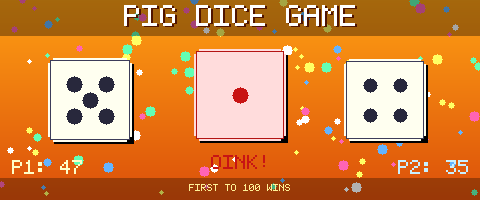

<div align="center">
  

  [](https://developer.mozilla.org/en-US/docs/Web/JavaScript)
  [](https://developer.mozilla.org/en-US/docs/Web/HTML)
  [](https://developer.mozilla.org/en-US/docs/Web/CSS)

  **🎲 The classic Pig dice game for two players — roll, hold, and race to 100 ⚡**

</div>

---

## 🎮 How to Play

Two players take turns. On your turn you have two choices:

| Action | Result |
|---|---|
| 🎲 **Roll** | Adds the dice value to your round score. Roll a **1** and you lose it all — turn passes. |
| ✋ **Hold** | Banks your round score into your total. Turn passes to the other player. |

**First to 100 points wins.**

The risk/reward of banking early vs. rolling again is what makes the game compelling.

## 🚀 Play Now

No build step, no dependencies. Just open `index.html` in your browser:

```bash
# Optionally serve it locally
npx serve .
```

## 🛠️ Tech Stack

- **Vanilla JavaScript** — no frameworks, no build tools
- **HTML5** + **CSS3** — pure browser rendering
- **Google Fonts** + **Ionicons** — typography and icons
